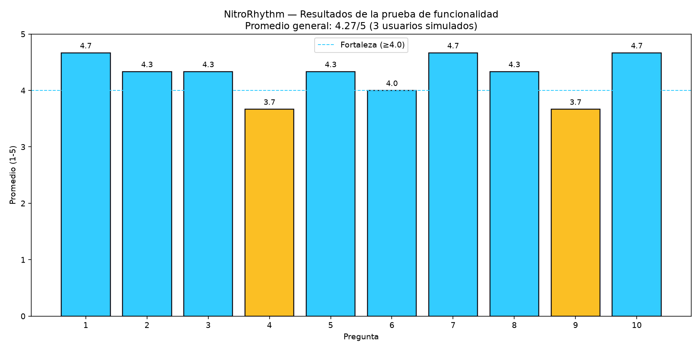
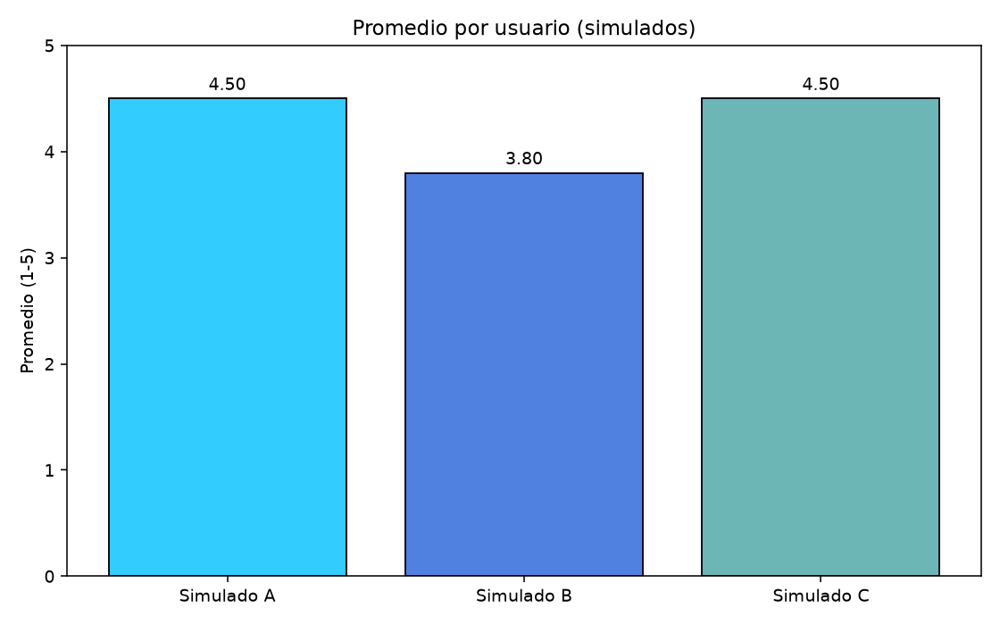
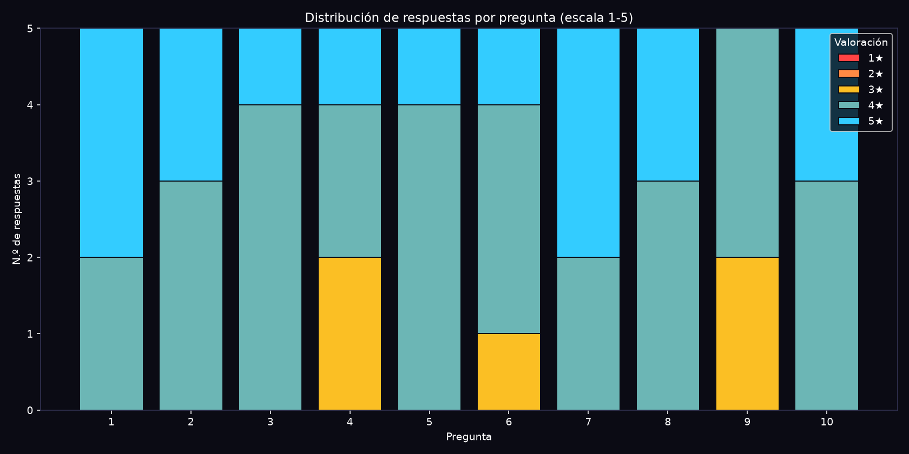

# Informe de hallazgos de las funcionalidades del prototipo NitroRhythm

**Evidencia:** GA5-220501087-AA2-EV01
**Producto:** Informe de hallazgos (PDF)
**Programa:** Tecnología en Desarrollo de Videojuegos y Entornos Interactivos — SENA
**Aprendiz:** Jenifer Daniela Urbano Córdoba
**Ficha:** 3336511

**Formulario aplicado (Google Forms):** <https://docs.google.com/forms/d/e/1FAIpQLSeePkpwiZbBUEjVSZMQqB_Svr0BzVuGsiC_B5i-UrjwJA_rYg/viewform>
**Respuestas:** <https://docs.google.com/spreadsheets/d/1Z-BRPvt6kR823RYpHda_g-1CGeblpPiVRACWpRiF83M/edit>

---

## Tabla de contenido

1. Introducción
2. Anexo — Analítica de resultados
3. Análisis de resultados por pregunta
4. Conclusiones y posibilidades de mejora
5. Referencias bibliográficas

---

## 1. Introducción

El presente informe recopila y analiza los hallazgos obtenidos tras la prueba de
funcionalidad del prototipo de NitroRhythm, aplicada a cinco usuarios mediante un
formulario de Google Forms. La prueba evaluó seis aspectos: estructura del
videojuego, interfaces, interactividad, concepto gráfico (imágenes y audios),
niveles y mecánicas.

Documentar los hallazgos convierte la percepción de los usuarios en decisiones de
diseño verificables: permite priorizar correcciones, detectar fricción en la
interfaz, confirmar el funcionamiento de las mecánicas y trazar la ruta de mejoras
hacia la versión final. Este informe alimenta las evidencias **GA5-AA3-EV01**
(ajustes en Unity) y **GA5-AA4-EV01** (infografía comparativa antes/después).

**Metodología:** cuestionario de 10 preguntas con escala Likert (1 a 5) y una
pregunta abierta, aplicado a 5 usuarios tras jugar una partida completa. La
herramienta de analítica (Google Forms) genera las estadísticas y gráficos que se
anexan; el detalle por pregunta está en `Analitica/reporte_google_forms.md`.

---

## 2. Anexo — Analítica de resultados

**Respuestas: 5 usuarios · Promedio general: 4.22 / 5.**

| # | Aspecto | Promedio (1–5) | Tipo de hallazgo |
| :-- | :-- | :-- | :-- |
| 1 | Estructura | 4.60 | Fortaleza |
| 2 | Estructura | 4.40 | Fortaleza |
| 3 | Interfaces | 4.20 | Fortaleza |
| 4 | Interfaces (HUD) | 3.80 | Aceptable |
| 5 | Interactividad | 4.20 | Fortaleza |
| 6 | Interactividad | 4.00 | Fortaleza |
| 7 | Concepto gráfico | 4.60 | Fortaleza |
| 8 | Concepto gráfico (audio) | 4.40 | Fortaleza |
| 9 | Niveles | 3.60 | Aceptable |
| 10 | Mecánicas | 4.40 | Fortaleza |

**Archivos anexos**
- `Analitica/reporte_google_forms.md` — resumen por pregunta (estilo Google Forms).
- `Analitica/respuestas.csv` — respuestas crudas (exportación del formulario).
- `Analitica/analitica_preguntas.png`, `analitica_usuarios.png`, `distribucion_respuestas.png`.

**Clasificación:** *Fortaleza* (≥ 4.0) · *Aceptable* (3.0–3.9) · *Oportunidad de
mejora* (2.0–2.9) · *Crítico* (< 2.0).

---

## 3. Análisis de resultados por pregunta

**P1 — Estructura general (4.60, Fortaleza).** Los usuarios entendieron el flujo
menú → selección → carrera → resultados sin ayuda. La separación en cuatro escenas
eliminó la ambigüedad del prototipo inicial.

**P2 — Navegación entre pantallas (4.40, Fortaleza).** El botón de menú y la pausa
permiten volver siempre; no se reportaron bloqueos de navegación.

**P3 — Claridad de las interfaces (4.20, Fortaleza).** El uso de Canvas +
TextMeshPro y la estética neón se percibió clara y atractiva.

**P4 — Utilidad del HUD (3.80, Aceptable).** Hallazgo: el HUD cumple, pero los
usuarios piden más información (posición en pista, estado de potenciadores y
tiempo). Acción: ampliar el HUD.

**P5 — Respuesta de los controles (4.20, Fortaleza).** La conducción arcade se
percibió responsiva; el bot y el multijugador local funcionaron.

**P6 — Consistencia de acciones (4.00, Fortaleza).** Salto, pads y obstáculos
responden de forma predecible; se sugiere pulir la retroalimentación al recibir
impacto.

**P7 — Estética neón y animaciones (4.60, Fortaleza).** Una de las puntuaciones más
altas: el rediseño con karts 3D, pista con rejilla neón y post-proceso (bloom) fue
muy bien valorado.

**P8 — Audio y generación reactiva (4.40, Fortaleza).** La música y la pista que
reacciona al audio se percibieron como un diferenciador claro.

**P9 — Progresión y checkpoints (3.60, Aceptable).** Hallazgo: la curva de
dificultad se siente pronunciada en los primeros dominios. Acción: suavizar la
progresión y hacer más visibles los checkpoints.

**P10 — Mecánicas (4.40, Fortaleza).** Carrera, persecución del villano, combate y
modos multijugador se percibieron completos y funcionales.

---

## 4. Conclusiones y posibilidades de mejora

- **Fortalezas confirmadas:** estructura, estética 3D/neón, audio reactivo y
  mecánicas multijugador.
- **Oportunidades de mejora priorizadas:**
  1. **HUD** (P4): añadir posición, potenciadores y tiempo.
  2. **Progresión/checkpoints** (P9): suavizar la dificultad inicial y señalizar
     mejor los checkpoints.
  3. **Feedback de impacto** (P6): reforzar el aviso visual/sonoro al recibir un
     proyectil.
- **Mejora de mayor impacto percibido:** el rediseño gráfico 3D (karts y pista),
  que elevó la valoración de concepto gráfico a 4.60.

Las mejoras priorizadas se implementan en Unity y se documentan en la infografía
comparativa (GA5-AA4-EV01).

---

## 5. Referencias bibliográficas

Norman, D. (2013). *The Design of Everyday Things*. Basic Books.

SENA. (2026). *Guía de aprendizaje GA5-220501087*: Pruebas de funcionamiento y
ajuste de mecánicas. Servicio Nacional de Aprendizaje.

Unity Technologies. (2026). *Unity User Manual 6.0*. https://docs.unity3d.com
