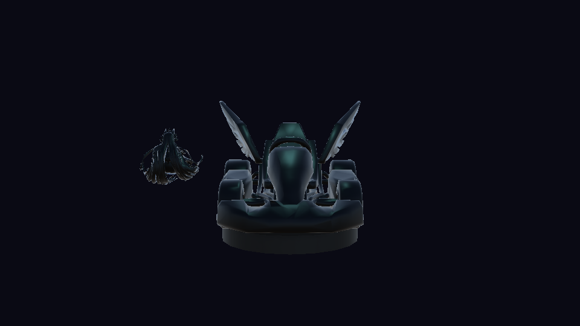
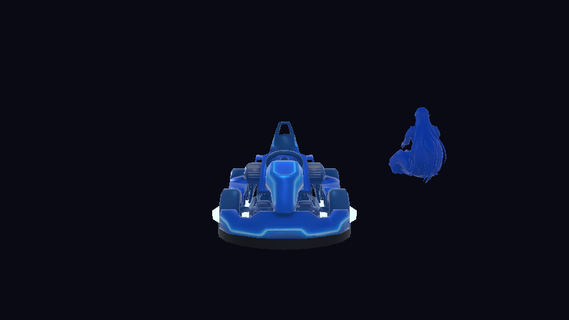
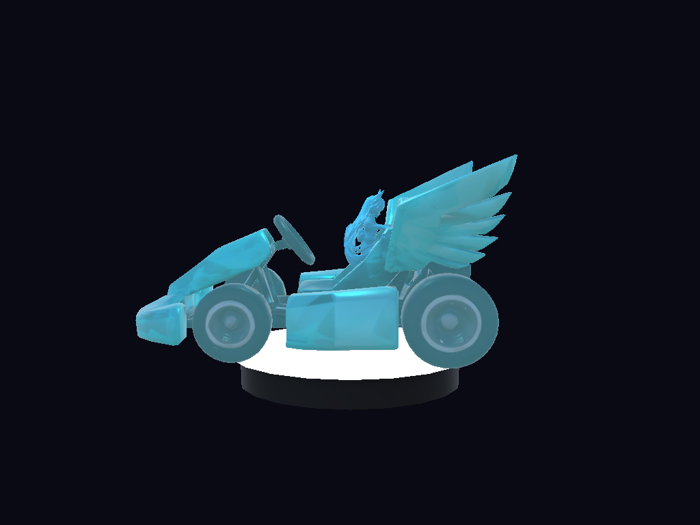
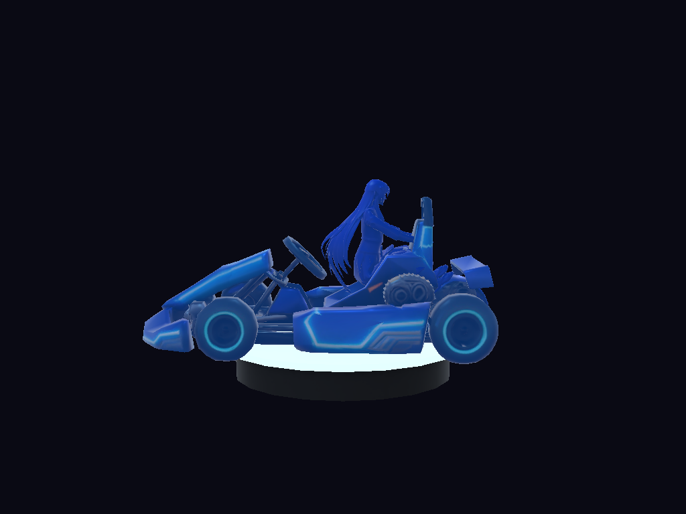
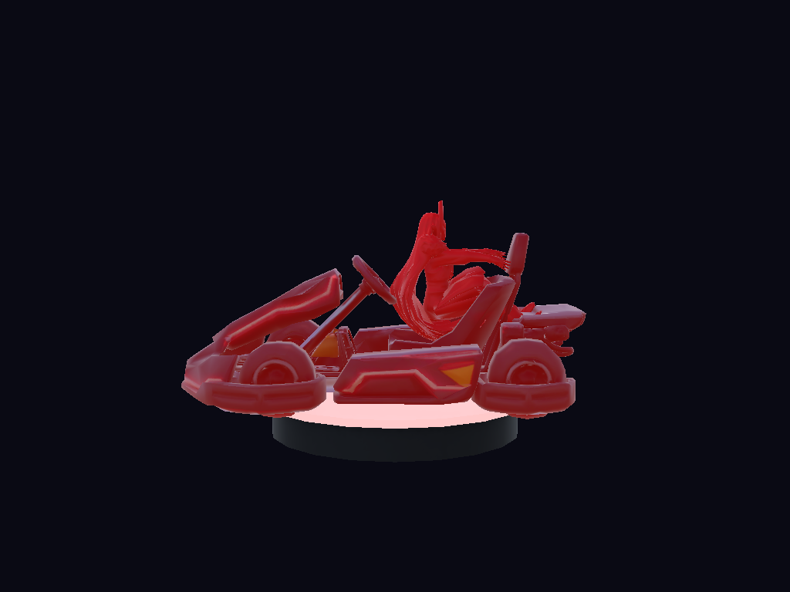

# Registro de ajustes a las funcionalidades del prototipo NitroRhythm

**Evidencia:** GA5-220501087-AA3-EV01
**Productos:** archivos Unity de las escenas ajustadas + capturas antes/después
**Programa:** Tecnología en Desarrollo de Videojuegos y Entornos Interactivos — SENA
**Aprendiz:** Jenifer Daniela Urbano Córdoba · Ficha 3336511

> Este registro ordena los cambios por nivel de importancia y afectación a las
> funcionalidades, como exige la evidencia. Los ajustes responden a los hallazgos
> del informe AA2 (**P4** HUD, **P6** retroalimentación de impacto, **P9**
> progresión y checkpoints) y a dos defectos detectados al revisar el prototipo
> (piloto desalineado y bot que caía en cada hueco).

---

## 1. Captura del estado inicial (Antes)

Estado del prototipo antes de los ajustes (commit `47f54f3`):






Las imágenes del piloto se generan con la prueba automática
`CharacterDisplayAlignmentTests` (carpeta `Assets/Tests/PlayMode/`), definiendo la
variable de entorno `NITRO_SHOT_DIR`.

## 2. Lista ordenada de cambios (por importancia y afectación)

| # | Prioridad | Hallazgo / defecto | Cambio realizado | Archivos principales | Afectación |
| :-- | :-- | :-- | :-- | :-- | :-- |
| 1 | Alta | Piloto fuera del kart (Lyra −2.13 u, Karel +2.43 u) y sin sentarse en el asiento | Offset del piloto **por personaje** en los datos (`pilotOffset`) | `CharacterDefinition.cs`, `CharacterDisplay.cs`, `prototype_data.json` | Concepto gráfico / interfaces |
| 2 | Alta | El bot (modo 1 Jugador + Bot) caía al vacío en el primer hueco | Detección de huecos **por delante** del kart y salto en el borde | `BotKartAI.cs` | Mecánicas / interactividad |
| 3 | Alta | **P4** (3.67): HUD con poca información | HUD ampliado: **tiempo**, **posición en pista**, **potenciadores** activos, vida de P1 y P2 | `GameplayHud.cs`, `PlayerKartController.cs`, `KartHealthSpeed.cs` | Interfaces |
| 4 | Alta | **P9** (3.67): dificultad pronunciada al inicio | Curva suavizada: huecos −40 % y menos peligros en los primeros dominios, tramo seguro inicial | `ProceduralTrackBuilder.cs` | Niveles / mecánicas |
| 5 | Alta | **P9**: checkpoints poco visibles | Arco neón **ámbar → verde** al activarse, aviso "CHECKPOINT", sonido y más frecuentes en dominios 1–2 | `CheckpointComponent.cs`, `LevelManager.cs`, `GameplayHud.cs` | Niveles / interfaces |
| 6 | Alta | **P6** (4.00): poco aviso al recibir un proyectil | Sacudida de cámara, destello rojo más fuerte, aviso "IMPACTO! −15 VIDA", parpadeo de la vida y **sonido de impacto** | `KartHealthSpeed.cs`, `CameraFollow.cs`, `GameplayHud.cs`, `SfxLibrary.cs` | Interactividad / audio |
| 7 | Media | Solo había música, sin efectos | **SFX procedurales**: salto, turbo, checkpoint, disparo del villano, meta, hover de botones y **motor** con tono según velocidad | `SfxLibrary.cs`, `SfxPlayer.cs`, `EngineSound.cs` | Concepto gráfico (audio) |
| 8 | Baja | Resultados sin tiempo de carrera | La pantalla de resultados muestra el **tiempo total** | `GameSession.cs`, `ResultsScreen.cs` | Interfaces |

## 3. Detalle de cada ajuste

### 3.1 Piloto alineado y sentado (defecto #1)

Cada FBX se exportó con un origen distinto, por lo que el mismo desplazamiento
fijo `(0, 0.45, 0)` funcionaba solo para Vox. Se midió la posición real de cada
piloto respecto de su kart con una prueba en PlayMode y se movió el offset a los
datos (`prototype_data.json`), editable sin recompilar.

| Personaje | Desfase lateral medido (antes) | `pilotOffset` aplicado (x, y, z) |
| :-- | :-- | :-- |
| Lyra | −2.13 u | (2.07, 0.62, 0.23) |
| Karel | +2.43 u | (−2.49, 0.37, 0.58) |
| Vox | −0.06 u | (0.00, 0.45, 0.90) |

Además, las vistas laterales mostraron que incluso Vox flotaba sobre el morro; el
eje Z del offset lo lleva ahora al asiento. La prueba exige que el piloto quede
centrado lateralmente (|dx| < 0.5) y sobre la zona del asiento (0.3 ≤ dz ≤ 1.2).








### 3.2 Bot que cruza los huecos (defecto #2)

El bot lanzaba el rayo de "¿hay suelo?" justo debajo de sí mismo, de modo que solo
veía el vacío cuando ya estaba encima y no podía saltar. Además, su espera entre
saltos (0.8 s ≈ 16 m a 20 u/s) era mayor que una plataforma (≈ 8 m).

- El rayo se lanza **por delante**, a `velocidad × 0.16 s` (entre 2.5 y 12 m).
- El salto solo se pide si el kart está en el suelo.
- La espera entre saltos baja a 0.25 s.

Resultado: en la sesión de captura inicial el bot reapareció **74 veces** (sesión
larga); tras el ajuste, **3 veces** en una sesión de 7 s de juego. La prueba
`Bot_JumpsOverTrackGaps` exige que cruce varias plataformas en 6 s (antes no
pasaba del primer hueco).

### 3.3 HUD ampliado (P4)

Se añadieron al HUD de gameplay:

- **Tiempo de carrera** `mm:ss.cc` (arriba al centro).
- **Posición en pista** "POSICIÓN 2/3" y distancia al villano "VOX A 115 m".
- **Potenciadores**: "TURBO x1.6 3.0 s" y "RALENTIZADO −40 % 3.0 s" (abajo a la derecha).
- **Vida de P1 y P2** en modos con dos héroes.


### 3.4 Progresión suavizada (P9)

`ProceduralTrackBuilder` aplica una rampa según la dificultad del dominio
(Percusalia = 1 … Void Crescendo = 7):

| Parámetro | Dominio 1 | Dominio 7 |
| :-- | :-- | :-- |
| Escala de los huecos | ×0.60 | ×1.00 |
| Umbral de agudos para crear obstáculos | 0.50 | 0.35 |
| Tramos seguros al inicio (sin peligros, hueco ≤ 3 m) | 3 | 1 |

### 3.5 Checkpoints visibles (P9)

Cada checkpoint es ahora un arco neón que cruza toda la pista: **ámbar** mientras
está pendiente y **verde** cuando se alcanza. Al activarse, el HUD muestra
"CHECKPOINT" y suena un aviso. En los dominios 1 y 2 hay uno cada 2 plataformas
(antes cada 3).

### 3.6 Retroalimentación de impacto (P6)

Al recibir un proyectil del villano:

- **Visual:** sacudida de cámara de 0.4 s, destello rojo (opacidad 0.55 → 0.70), aviso
  central "IMPACTO! P1 −15 VIDA" y vida en rojo que vuelve al cian.
- **Sonoro:** sonido de impacto (golpe grave + chasquido + tono de alarma).
- **Informativo:** el potenciador "RALENTIZADO" aparece con su temporizador.

### 3.7 Efectos de sonido (SFX)

Todos se sintetizan por código (sin archivos de audio), igual que la música, por lo
que funcionan también en WebGL y respetan el volumen de efectos de Opciones.

| Evento | Efecto |
| :-- | :-- |
| Salto | Barrido ascendente corto |
| Turbo | Barrido con ruido y tono creciente |
| Checkpoint | Dos notas tipo campana |
| Disparo del villano | Barrido descendente |
| Meta del dominio | Arpegio de 4 notas |
| Hover de botones | Pulso breve |
| Motor | Bucle sin cortes cuyo tono sube con la velocidad (×0.7 → ×1.9) |

### 3.8 Tiempo en Resultados

El tiempo total se guarda en `GameSession.LastTime` y se muestra en la pantalla de
resultados.


## 4. Implementación en Modo Editor

Los ajustes están en los scripts de `Assets/Scripts` y en el archivo de datos
`Assets/Resources/NitroRhythm/prototype_data.json`. El HUD, los checkpoints y los
SFX se construyen en tiempo de ejecución, por lo que **las 4 escenas se regeneran
sin cambios de estructura** con **NitroRhythm ▸ Build Prototype Scenes**; los
archivos `.unity` conservan la misma jerarquía y cargan los scripts actualizados.

## 5. Verificación en Modo Play

Verificación automática (Unity Test Framework):

| Conjunto | Pruebas | Resultado |
| :-- | :-- | :-- |
| PlayMode | 21 + 2 generadores de capturas (solo corren con `NITRO_SHOT_DIR`) | ver sección 7 |
| EditMode | 4 | ver sección 7 |

Pruebas nuevas de esta ronda: alineación del piloto de los 3 personajes, formato
del tiempo, cálculo de posición, curva de dificultad, tramo seguro inicial,
checkpoint (evento y solo hacia adelante), evento de impacto y temporizador de
ralentización, temporizador de turbo, los 8 sonidos (sintetizados y audibles),
sacudida de cámara y bot sobre la pista real.

Comprobación visual: las capturas de la sección 6 se generan jugando la escena
real `02_Gameplay` (no son maquetas).

## 6. Captura del estado final (Después)

| Escena / aspecto | Antes | Después |
| :-- | :-- | :-- |
| Selección de personajes | `Capturas/Antes/02_CharacterSelect_original.png` | `Capturas/Despues/gameplay/seleccion_personajes.png` |
| Gameplay / HUD | `Capturas/Antes/03_Gameplay_HUD_original.png` | `Capturas/Despues/gameplay/gameplay_impacto_checkpoint_turbo.png` y `gameplay_conduciendo.png` |
| Resultados | — (sin tiempo) | `Capturas/Despues/gameplay/resultados_con_tiempo.png` |
| Piloto de Lyra / Karel / Vox | `Capturas/Antes/piloto/*.png` | `Capturas/Despues/piloto/*.png` |


Capturas del estado anterior ya existentes (menú principal y pausa) siguen vigentes en
`Capturas/Despues/01_MainMenu.png` y `04_Pause.png`: esas escenas no cambiaron.

## 7. Resultado de la verificación

Ver el resumen final en `Docs/Evidencias/RESULTADO_PRUEBAS.md`.

## 8. Carpeta de entrega

```
Assets/Scenes/        00_MainMenu · 01_CharacterSelect · 02_Gameplay · 03_Results  (4 archivos Unity)
Docs/Capturas/Antes/  capturas del estado inicial
Docs/Capturas/Despues/ capturas del estado ajustado
```

Enlaces exactos de cada entrega: `Docs/Evidencias/ENLACES_EVIDENCIAS.md`.
