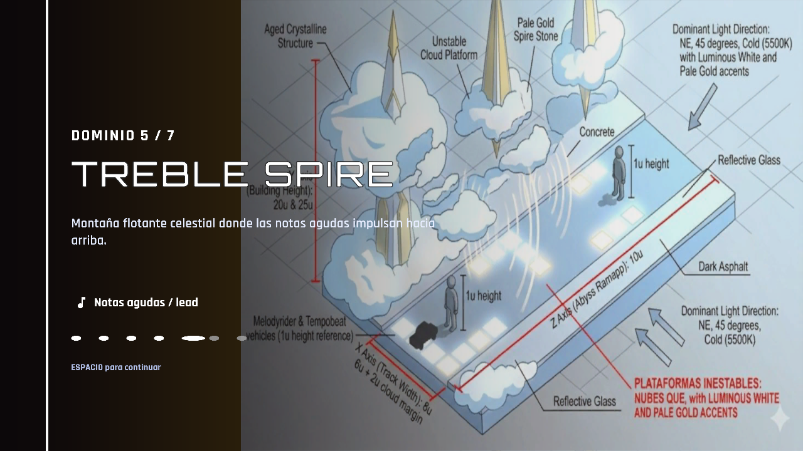
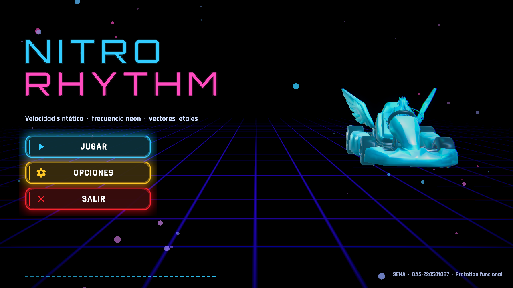
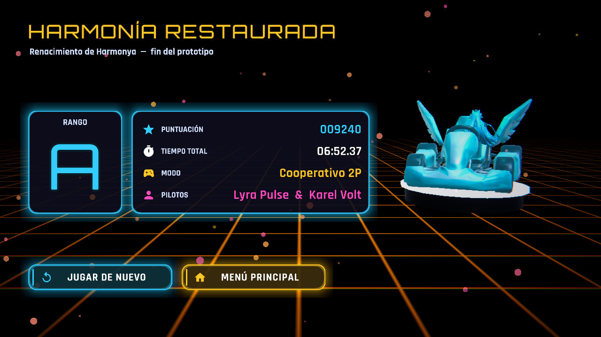

# Registro de ajustes — Ronda 2 del prototipo NitroRhythm

**Evidencia:** GA5-220501087-AA3-EV01 (continuación del registro de la ronda 1)
**Productos:** ajustes en Unity (scripts, datos y assets) + capturas antes/después
**Programa:** Tecnología en Desarrollo de Videojuegos y Entornos Interactivos — SENA
**Aprendiz:** Jenifer Daniela Urbano Córdoba · Ficha 3336511

> Segunda ronda de mejoras tras probar la build de la ronda 1. La prueba dejó seis
> observaciones: los modelos de la selección "salían al revés", en la partida casi todo
> eran cubos, los niveles no eran temáticos, había demasiados checkpoints, el villano no
> lanzaba obstáculos y la interfaz era muy básica. Este registro ordena los cambios por
> importancia y afectación.

---

## 1. Estado inicial de esta ronda (Antes)

## 2. Lista ordenada de cambios (por importancia y afectación)

| # | Prioridad | Observación / causa | Cambio realizado | Archivos principales | Afectación |
| :-- | :-- | :-- | :-- | :-- | :-- |
| 1 | Alta | **El villano no atacaba.** Solo disparaba a ≤ 45 m, corría a velocidad fija (26 u/s) mientras los karts van a ~40 u/s y quedaba a 115–180 m; el proyectil apuntaba a la posición vieja, volaba a 6 m de altura y casi nunca golpeaba | Correa de distancia al líder (18–38 m), ataque **al compás de la música**, 4 tipos de ataque (directo, ráfaga, mina, barrera giratoria), marcador rojo de impacto (telegrafía), puntería con predicción, daño por área, el villano salta huecos y espera si el jugador cae | `VillainBoss.cs`, `BadReward.cs` | Mecánicas |
| 2 | Alta | **Se veían cubos.** El bot se creaba sin personaje (cubo azul), el modelo del kart quedaba orientado hacia atrás, el piloto no aparecía en carrera y el flash de daño apuntaba al cubo oculto | Bot con su personaje y modelo, kart orientado hacia adelante, **piloto sentado en carrera**, flash sobre el modelo, K.O. al llegar a 0 de vida (vuelve al checkpoint) | `VisualEntityFactory.cs`, `TestSceneBootstrapper.cs`, `KartHealthSpeed.cs` | Concepto gráfico |
| 3 | Alta | **Niveles sin identidad:** los 7 dominios eran los mismos cubos con otro tinte y el cielo ni se aplicaba | **Una pantalla por nivel** con tarjeta de introducción; cada dominio con cielo (HDRI libres + cielos procedurales), luz, niebla, plataformas texturizadas, props, partículas y gradación de color propios | `GameSession.cs`, `SceneFlow.cs`, `LevelManager.cs`, `LevelIntroCard.cs`, `World/*` | Niveles |
| 4 | Alta | **Demasiados checkpoints** (≈ 121 en toda la carrera) | Regla por posición: 1 en los dominios 1–2, 2 en los 3–6 y 3 en el último → **13 en total**, nunca sobre trampas | `LevelManager.cs` | Niveles |
| 5 | Alta | **Interfaz muy básica** | Tipografía Orbitron + Rajdhani, iconos Material, tarjetas neón con halo, HUD rediseñado, menús con fondo animado y música, retratos del concept art, rango en resultados, fundidos entre pantallas | `UIFactory.cs`, `GameplayHud.cs`, `MainMenuScreen.cs`, `CharacterSelectScreen.cs`, `ResultsScreen.cs`, `OptionsPanel.cs`, `PauseMenu.cs` | Interfaces |
| 6 | Media | **Modelos "al revés" en la selección** (giraban 360° y se veía la trasera la mitad del tiempo) | Vista 3/4 estable con vaivén suave | `CharacterDisplay.cs`, `CharacterSelectScreen.cs` | Interfaces |
| 7 | Media | **Tus modelos reales apenas se usaban** | Se integran las torres-altavoz (`Torre1–4`), los premios (`PrizeGood`/`PrizeBad`), la clave de sol y la bola de espinas (de `Modelos3D`, reducidas de 50 000 a 4–5 mil triángulos y texturas de 4096 a 512–1024 px) | `Docs/Tools/blender/prepare_props.py`, `Docs/Tools/extract_unitypackage.py`, `Resources/NitroRhythm/Props` | Concepto gráfico |
| 8 | Media | **Sonido plano** (misma música en todos los niveles) | **Música sintetizada por dominio** (tempo, tonalidad y ritmo propios; la pista nace de esa música) y **ambiente sonoro** propio | `DomainMusic.cs`, `AmbientBed.cs` | Audio |

## 3. Detalle de cada ajuste

### 3.1 Villano que ataca (cambio #1)

Causas confirmadas en el código: rango de disparo de 45 m, velocidad fija del villano,
posición de colocación calculada antes de que existiera la pista, intervalo de 2
pulsos, punto de disparo 5 m delante del kart y proyectil que cruzaba a 6 m de altura.

Comportamiento nuevo:

- **Correa:** el villano mantiene 18–38 m de ventaja sobre el líder (ajusta su velocidad y se
  recoloca delante si se aleja más de 70 m). Si todos los jugadores caen, espera.
- **Compás:** ataca cada 2 pulsos de la música. Si el dispositivo de audio no avanza el reloj
  (ejecución sin sonido) usa un reloj interno con la misma rejilla de pulsos.
- **Ataques:** *directo* (proyectil con tu modelo `PrizeBad`), *ráfaga* de 3 en abanico, *mina*
  que queda armada sobre la pista y *barrera giratoria* que se levanta delante del jugador.
- **Legibilidad:** un disco rojo parpadeante marca dónde caerá cada proyectil durante 1.1 s;
  la puntería usa la velocidad del jugador (`posición + velocidad × tiempo`) y el daño es por
  área (2.4 m).
- **Verificación:** en la partida real del dominio 7 realizó **20 ataques en ~15 s** (directo, mina,
  barrera y ráfaga) y se mantuvo a ~60 m del jugador (que estaba quieto).

### 3.2 Modelos reales en la partida (cambios #2 y #7)

- El FBX del kart tiene el morro hacia +Z, que es el avance del kart; antes se rotaba 180° y el
  kart conducía de culata.
- El piloto se coloca en el asiento usando el `pilotOffset` por personaje de la ronda 1,
  rotado a la orientación del kart y escalado a su tamaño en carrera.
- Las **torres-altavoz** forman los pilares de cada checkpoint y decoran los dominios; los
  **premios** `PrizeGood` son recogibles en la pista (turbo ×1.5 durante 2 s); `PrizeBad` es el
  proyectil del villano; la **bola de espinas** forma las barras y los peligros móviles.

### 3.3 Una pantalla por nivel con ambiente propio (cambio #3)

Cada dominio carga como su propia pantalla (escena de gameplay con el número de nivel). Antes
de jugar aparece una tarjeta con la ilustración de concept art del dominio, su nombre, su
descripción y su música.

| Dominio | Ambiente | Cielo | Plataforma | Props |
| :-- | :-- | :-- | :-- | :-- |
| Percusalia | Desierto dorado al atardecer | HDRI atardecer | Ladrillos arena con vetas doradas | Tambores que laten con el bajo, estacas, dunas, torres |
| Echoris | Ciudad neón de espejos | HDRI cielo nocturno | Cristal con rejilla cian | Rascacielos con ventanas encendidas, anillos, torres |
| Bassline Abyss | Abismo índigo | Cielo procedural | Retícula violeta | Islas flotantes, anillos que laten, torres |
| Arpeggion | Selva de cristal | Cielo procedural esmeralda | Facetas de cristal | Cristales, arpas, clave de sol, islas |
| Treble Spire | Montaña celeste | HDRI nubes | Nube azulada | Nubes, agujas blancas y doradas, clave de sol |
| Noctua Chord | Espacio estelar de jazz | HDRI luna | Polvo de estrellas | Claves de sol brillantes, anillos, islas |
| Void Crescendo | Vacío carmesí | Cielo procedural negro | Grietas rojas | Agujas rojas, monolitos, bolas de espinas, anillos |

### 3.4 Checkpoints (cambio #4)

Se eligen por posición (a k/(n+1) de la longitud del nivel) evitando segmentos con peligros,
pads o rampas. Total: 1 + 1 + 2 + 2 + 2 + 2 + 3 = **13** (antes ≈ 121). Cada checkpoint es un arco
con tus torres-altavoz como pilares; es ámbar al inicio y verde al alcanzarlo, y el HUD
marca su posición en la barra de progreso.

### 3.5 Interfaz (cambio #5)

- **Fuentes libres:** Orbitron (títulos, licencia OFL), Rajdhani (texto, OFL) e iconos de
  Material Icons (Apache 2.0). Se generan como fuentes TextMeshPro con
  `Assets/Editor/FontAssetBuilder.cs`.
- **Componentes:** tarjetas con marco neón y halo, botones con icono, barras capsulares,
  anillo del velocímetro, deslizadores nuevos, fundido entre pantallas.
- **Pantallas:** menú con título animado, partículas, ecualizador y música; selección con
  retratos de tu concept art y tarjetas de estadísticas; resultados con rango S/A/B/C y
  puntuación animada; opciones y pausa con iconos.
- **HUD:** dominio y puntuación, posición y distancia al villano, cronómetro, vida de P1 y P2,
  velocímetro de anillo con pulso al ritmo, progreso con marcadores de checkpoint, chips de
  turbo y ralentizado, avisos de checkpoint e impacto.

### 3.6 Música y ambiente por dominio (cambio #8)

Cada dominio tiene su propio perfil musical sintetizado (tempo, tonalidad, bombo, bajo, hi-hats,
arpegio, eco o latido). El analizador detecta el tempo de cada una y la pista se construye a
partir de ella, así que también cambia la forma de los niveles:

| Dominio | BPM del perfil | BPM detectado |
| :-- | :-- | :-- |
| Percusalia | 118 | 120.0 |
| Echoris | 128 | 130.4 |
| Bassline Abyss | 98 | 96.8 |
| Arpeggion | 124 | 125.0 |
| Treble Spire | 134 | 136.4 |
| Noctua Chord | 106 | 107.1 |
| Void Crescendo | 72 | 71.4 |

## 4. Implementación en Modo Editor y verificación en Modo Play

Los cambios están en `Assets/Scripts` (incluida la nueva carpeta `World/`), en
`Assets/Resources/NitroRhythm` (datos, props, cielos, retratos, ilustraciones, fuentes) y en las
herramientas de `Docs/Tools`. Las escenas conservan su estructura y construyen el nivel en
tiempo de ejecución.

Verificación automática (Unity Test Framework): ver `Docs/Evidencias/RESULTADO_PRUEBAS.md`. Pruebas
nuevas de esta ronda: villano (permanece en rango y ataca; los 4 ataques; conteo de
checkpoints), orientación del kart y piloto sentado, una pantalla por nivel (sesión, reinicio,
construcción de un solo dominio), temas y props fuera de la pista, música y ambiente de cada
dominio, fuentes, HUD y componentes de interfaz, y rango de resultados.

Comprobación visual: todas las capturas de este documento se generan jugando las escenas reales
con las pruebas `GameplayEvidenceCapture` (variable de entorno `NITRO_SHOT_DIR`).

## 5. Créditos y licencias

Ver `Docs/CREDITOS_Y_LICENCIAS.md`.
