# Infografía comparativa — Ajustes realizados al prototipo NitroRhythm

**Evidencia:** GA5-220501087-AA4-EV01
**Producto:** Infografía comparativa (plantilla gratuita) + PDF
**Programa:** Tecnología en Desarrollo de Videojuegos y Entornos Interactivos — SENA

**Enlace de la infografía en Canva:** https://canva.link/j1aecdvqxvhjluh

> Contenido listo para montar en **Canva** (plantilla gratuita). Cada sección
> incluye la descripción *Antes* y *Después* y la imagen exacta a usar, tomada de
> `Docs/Capturas/Antes` y `Docs/Capturas/Despues` del repositorio.

> **Nota sobre el "antes":** como no se conservaron capturas del prototipo
> original, el estado *antes* se **reconstruye** con una captura simulada del
> primer prototipo (primitivas y HUD en texto plano), en
> `Docs/Capturas/Antes/legacy/`. El estado *después* son capturas reales de la
> versión final.

---

## Encabezado

**NITRORHYTHM** — Prototipo funcional · Comparativa antes / después de los ajustes
Evidencia GA5-220501087-AA4-EV01 · SENA · Jenifer Daniela Urbano Córdoba

---

## 1. Estructura e interfaces del juego

**Antes:** una única escena de prueba (`SampleScene`) con menú y HUD dibujados por
código (`OnGUI`), sin separación de pantallas ni navegación formal.

**Después:** cuatro escenas diferenciadas — **Menú principal**, **Selección de
piloto**, **Gameplay** y **Resultados** — con interfaces construidas en **Canvas +
TextMeshPro** (menú con botones, opciones con sliders de audio, pausa y HUD con
velocímetro radial, barra de progreso y puntuación).
_[Imagen Antes: menú OnGUI] → [Imagen Después: menú Canvas]_

**Ajuste de esta ronda (hallazgo P4):** el HUD de la carrera pasó de mostrar solo
puntuación, dominio, velocidad y vida de P1 a incluir **tiempo, posición en pista,
distancia al villano, potenciadores activos con temporizador y vida de P1 y P2**.

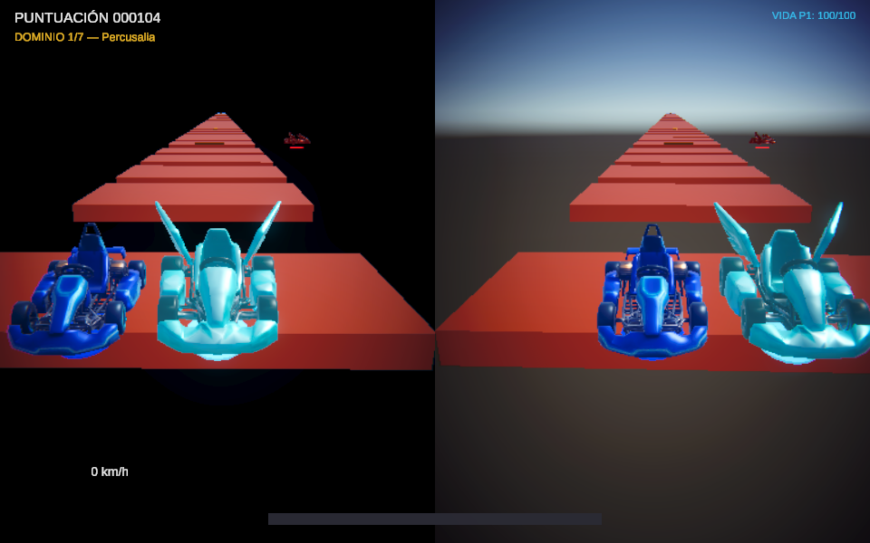

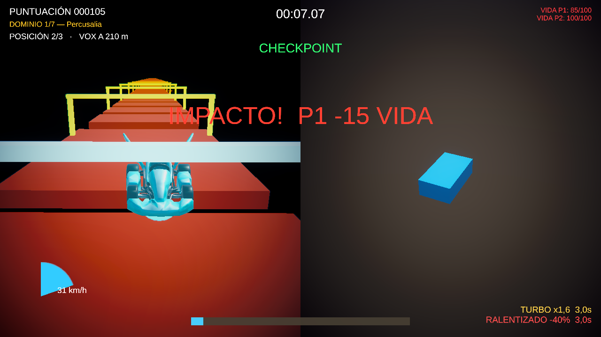

## 2. Concepto gráfico (imágenes y audios)

**Antes:** entidades con primitivas cúbicas de color plano; sin audio reactivo.

**Después:** estética neón URP con **modelos 3D generados en Blender** (tres karts,
pilotos y proyectil), paletas por personaje (Lyra teal, Karel azul, Vox rojo),
temas de color por dominio y **música sintetizada con generación de pista reactiva
al audio**.
_[Imagen Antes: cubos] → [Imagen Después: kart con modelo 3D y HUD]_

**Ajuste de esta ronda:** los pilotos de Lyra y Karel aparecían fuera de su kart
(desfase de 2.1 y 2.4 unidades) y ninguno estaba sentado. Ahora los tres van en el
asiento, con la posición definida por personaje en `prototype_data.json`.

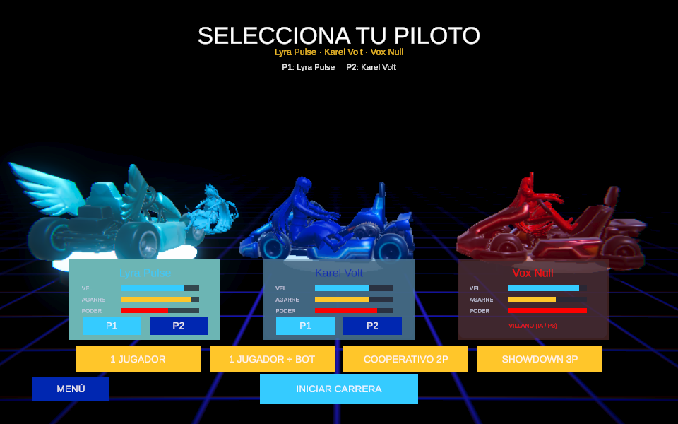

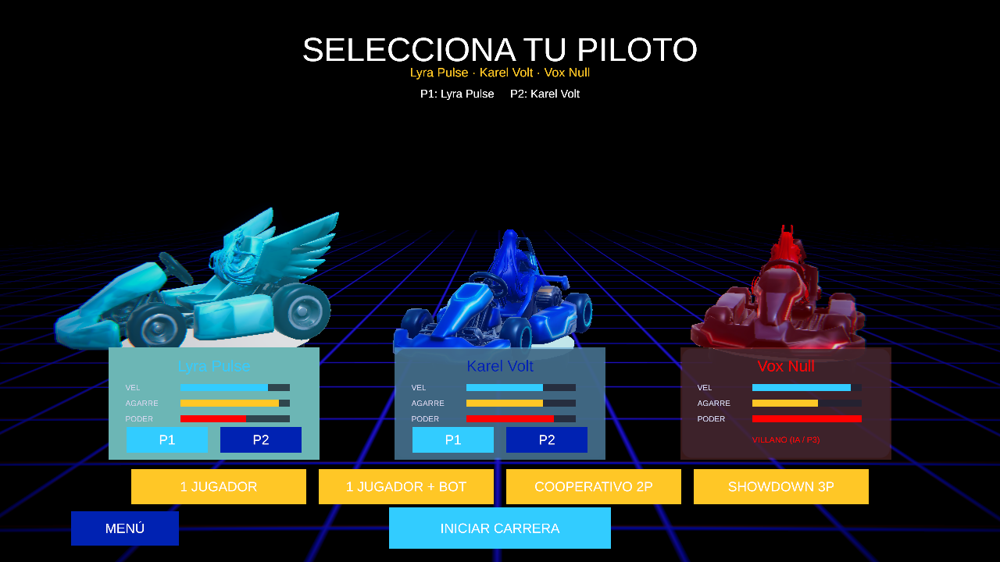

**Audio:** además de la música reactiva, se añadieron **efectos de sonido**
(salto, turbo, checkpoint, disparo, meta, impacto, hover y motor), generados por
código para que funcionen también en la versión web.

## 3. Niveles del videojuego

**Antes:** pista procedural lineal sin temática ni narrativa.

**Después:** **10 dominios musicales** (Conservatorio → Percusalia → Echoris →
Bassline Abyss → Arpeggion → Treble Spire → Noctua Chord → Encrucijada → Void
Crescendo → Harmonya), 7 jugables con dificultad progresiva, **checkpoints
intermedios** y cutscenes de escape del villano.
_[Imagen Antes: pista gris] → [Imagen Después: dominio con tema dorado/azul]_

**Ajuste de esta ronda (hallazgo P9):** progresión más amable al inicio — huecos
un 40 % más cortos y menos peligros en el primer dominio, 3 tramos seguros al
comenzar cada nivel y checkpoints cada 2 plataformas (antes cada 3) en los dominios
1 y 2. Los checkpoints son ahora arcos neón **ámbar → verde** con aviso en pantalla.

## 4. Mecánicas del videojuego

**Antes:** movimiento básico y villano estático; proyectil con trayectoria
inconsistente.

**Después:** karts arcade con salto y reaparición conservando impulso, **4 modos
multijugador local** (1P, 1P+Bot, Coop 2P, Showdown 3P), villano que persigue y
dispara con **cadencia sincronizada al BPM**, impacto con pérdida de vida y
penalización de velocidad, y pista cuya dificultad nace de la música.
_[Imagen Antes: gameplay simple] → [Imagen Después: split-screen co-op con HUD]_

**Ajustes de esta ronda:**

- **Impacto (hallazgo P6):** sacudida de cámara, destello rojo, aviso "IMPACTO! −15
  VIDA", vida parpadeando en rojo y sonido de golpe, además del potenciador
  "RALENTIZADO −40 %" con su temporizador.
- **Bot:** en el modo 1 Jugador + Bot el compañero ahora detecta los huecos por
  delante y salta en el borde; antes caía al vacío en el primer hueco.
- **Resultados:** la pantalla final muestra el tiempo total de la carrera.

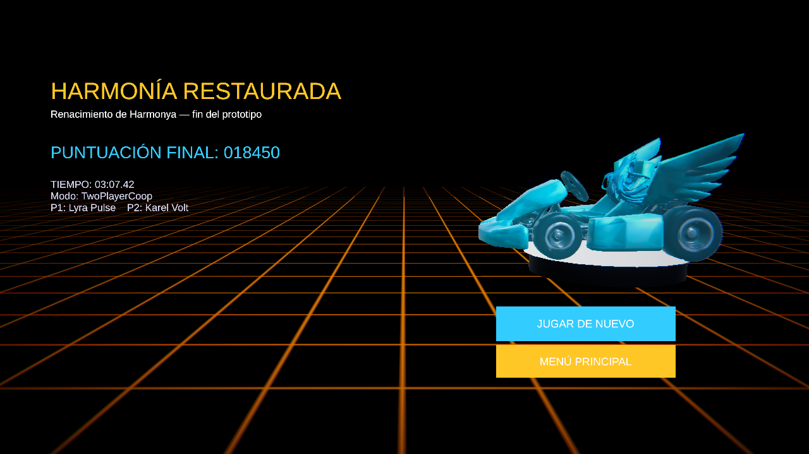

## 5. Ronda 2: de un prototipo de cubos a un mundo con identidad

**Antes:** al probar la ronda 1 se vio que los modelos de la selección "salían al revés", la
partida mostraba cubos (el bot era un cubo azul), los siete niveles eran iguales con otro
tinte, había unos 121 checkpoints, el villano no atacaba y la interfaz era muy básica.

**Después:**

- **Interfaz:** tipografía Orbitron/Rajdhani, iconos, tarjetas neón con halo, HUD rediseñado,
  retratos de los personajes tomados del concept art, rango S/A/B/C en resultados y fundidos
  entre pantallas.
- **Niveles:** una pantalla por dominio con tarjeta de introducción, cielo, luz, niebla,
  plataformas, props, partículas, música y ambiente propios (siete mundos distintos).
- **Mecánicas:** el villano ataca al compás de la música con cuatro tipos de ataque y avisos en
  el suelo; 13 checkpoints en total; premios recogibles; K.O. que devuelve al checkpoint.
- **Modelos reales:** tus karts con su piloto sentado, torres-altavoz, premios, clave de sol y
  bola de espinas dentro del juego.

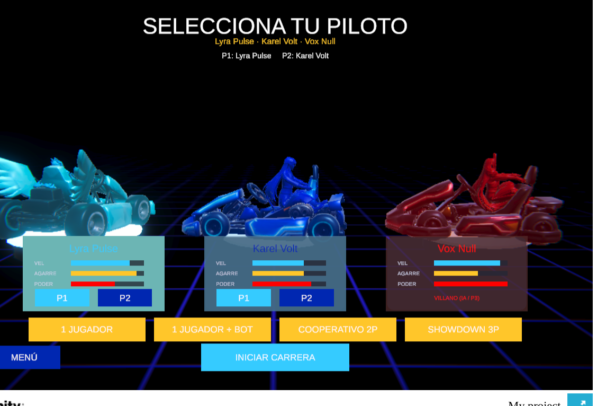

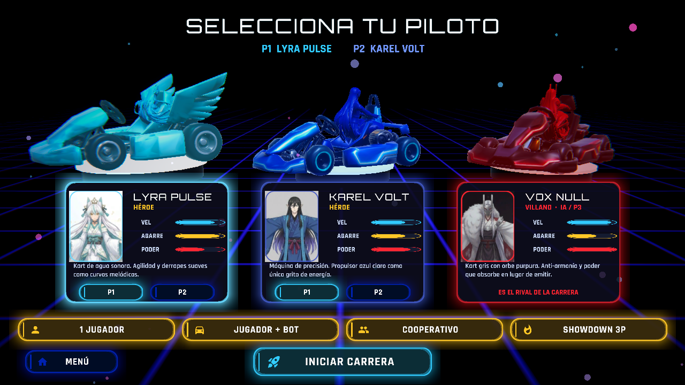

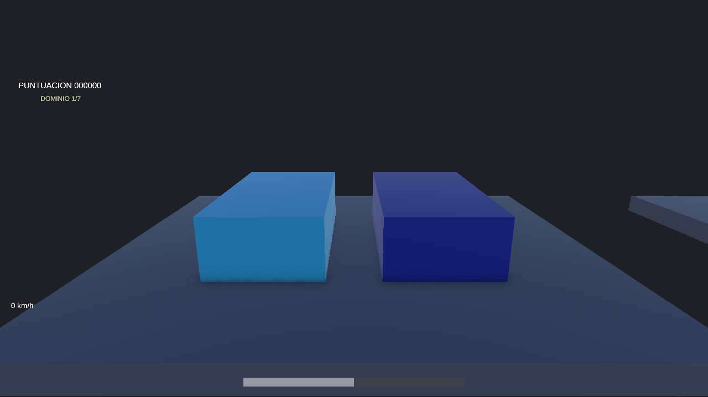

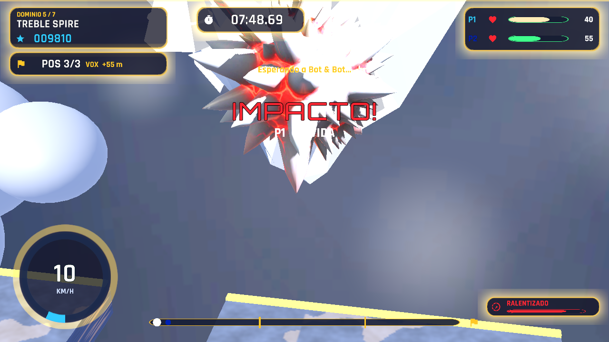

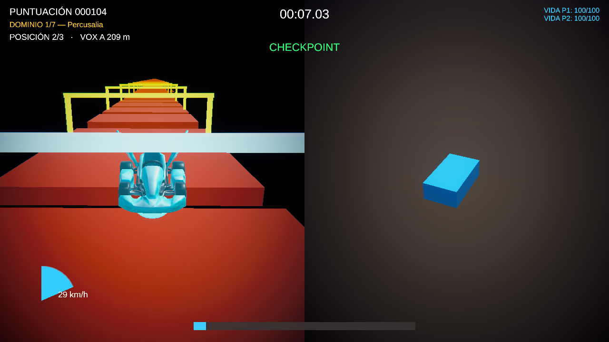

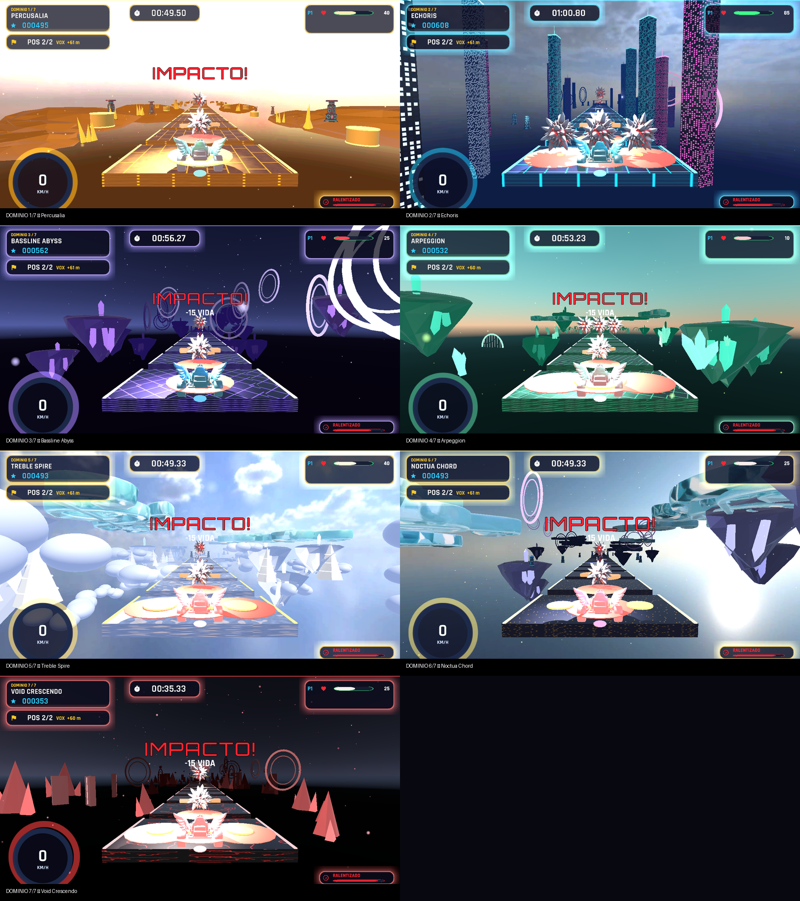

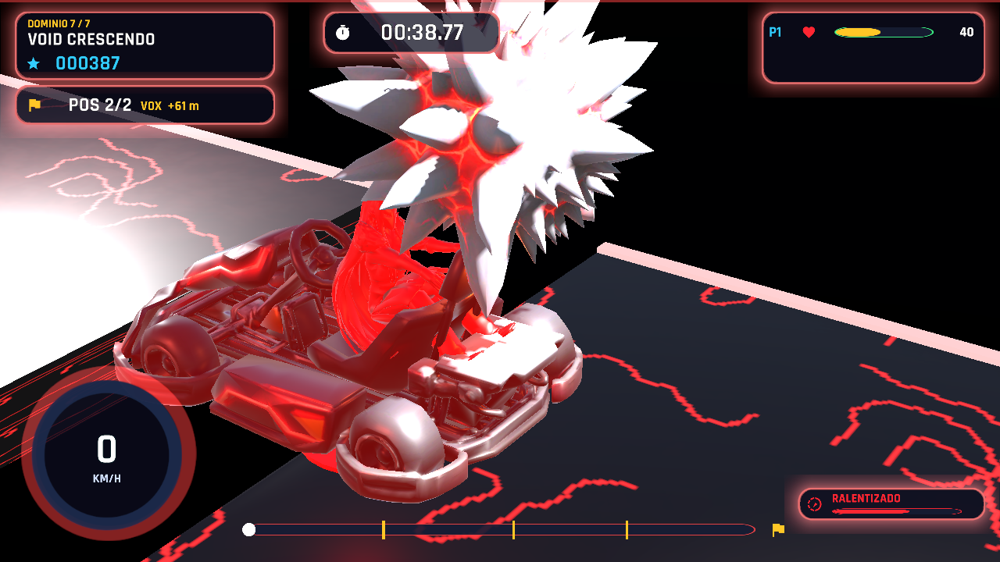

## 6. Conclusión de la comparativa

- La **estructura** pasó de un único escenario a un flujo completo de pantallas.
- Las **interfaces** migraron a Canvas/TMP y el HUD se amplió con tiempo, posición y potenciadores.
- El **concepto gráfico** ganó identidad (3D, neón, audio reactivo).
- Los **niveles** incorporaron progresión, tema y narrativa.
- Las **mecánicas** se completaron con multijugador, combate, checkpoints visibles, bot funcional y feedback de impacto.
- Los **hallazgos P4, P6 y P9** del informe AA2 quedaron atendidos y verificados con pruebas automáticas.
- La **ronda 2** llevó el prototipo a un mundo temático, con modelos propios, música por dominio, un villano que sí ataca y una interfaz coherente.

---

### Instrucciones de montaje en Canva

1. Cree un diseño de infografía vertical (1080 × 2400 px).
2. Copie cada sección y coloque las imágenes Antes / Después en paralelo. Las
   imágenes (formato PNG) están en `Docs/Capturas/Antes/` y `Docs/Capturas/Despues/`:
   - Estructura e interfaces: `Antes/legacy/legacy_menu.png` ↔ `Despues/ronda2/ui/ui_menu_principal.png`
   - Concepto gráfico: `Antes/legacy/legacy_select.png` ↔ `Despues/ronda3/seleccion_personajes.png`
   - Niveles: `Antes/legacy/legacy_track.png` ↔ `Despues/ronda2/RESUMEN_dominios.png`
   - Mecánicas: `Antes/legacy/legacy_gameplay.png` ↔ `Despues/ronda3/gameplay_ko_cuenta_regresiva.png`
3. Use los colores del juego: cian `#33CCFF`, dorado `#FBBF24`, rojo `#FF0000`.
4. Exporte a **PDF** y comparta el enlace.
